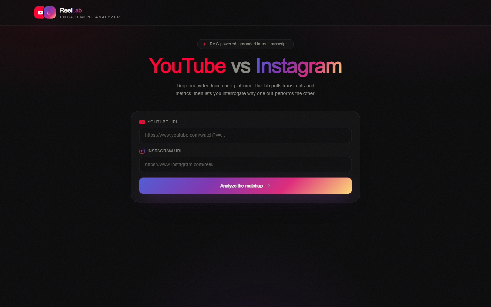
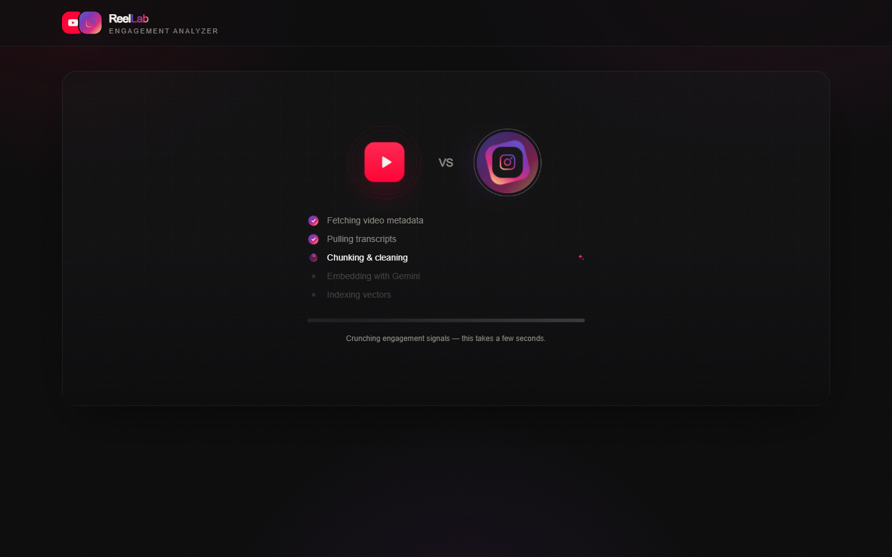
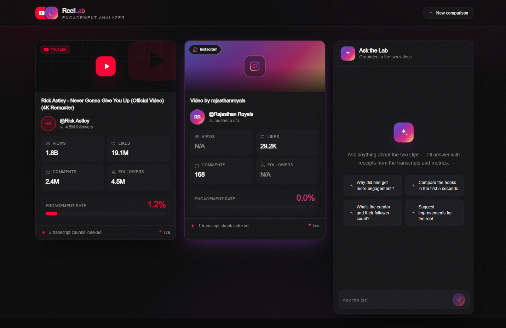
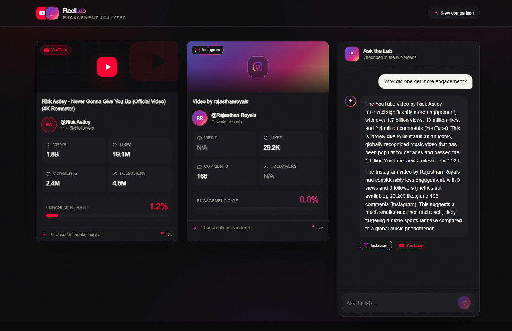

# ReelLab — RAG Video Engagement Analyzer 🎬

Pit a **YouTube** video against an **Instagram** reel, then chat with an AI that answers _grounded in the actual transcripts and engagement metrics_. Built with FastAPI + LangChain on the backend and a branded Next.js 14 interface on the front.

   

---

## 📸 Screenshots

### Landing — pick your matchup

A branded dual-URL entry point with the YouTube-red vs Instagram-gradient identity.



### Analyzing — live extraction pipeline

Dueling platform emblems and a step-by-step status while transcripts are pulled, chunked, embedded, and indexed.



### Results — side-by-side engagement breakdown

Per-platform cards with views, likes, comments, followers, and the engagement-rate meter (`N/A` where Instagram hides a metric).



### Ask the Lab — grounded, cited answers

A RAG chat that answers from the transcripts and metrics, with per-video source chips on every reply.



---

## What it does

1. **Ingests** one YouTube URL + one Instagram URL.
2. **Extracts** metadata (views, likes, comments, creator, followers) and the transcript/caption.
3. **Computes** engagement rate = `(likes + comments) / views × 100`.
4. **Chunks & embeds** the transcript and stores the vectors (in-memory by default, Pinecone optional).
5. **Answers questions** over the two videos via Retrieval-Augmented Generation — every reply cites which video it came from.

**Example prompts**

- _Why did one get more engagement than the other?_
- _Compare the hooks in the first 5 seconds._
- _Who's the creator and their follower count?_
- _Suggest improvements for the reel based on what worked on YouTube._

---

## Tech stack

| Layer                 | Technology                                                                               |
| --------------------- | ---------------------------------------------------------------------------------------- |
| **Frontend**          | Next.js 14 (App Router) · React 18 · TailwindCSS · Syne + Hanken Grotesk                 |
| **Backend**           | FastAPI · Python 3.11                                                                    |
| **RAG orchestration** | LangChain                                                                                |
| **LLM (chat)**        | Gemini `gemini-2.5-flash` _(primary)_ → OpenAI `gpt-4o` _(fallback)_                     |
| **Embeddings**        | Gemini `gemini-embedding-001` _(primary)_ → OpenAI `text-embedding-3-small` _(fallback)_ |
| **Vector store**      | In-memory cosine store _(default)_ · Pinecone _(optional)_                               |
| **Video extraction**  | `yt-dlp` + `youtube-transcript-api`                                                      |

> **Why Gemini-first?** Both Gemini and OpenAI expose an OpenAI-compatible API, so the same LangChain `ChatOpenAI` / `OpenAIEmbeddings` clients drive either — no extra SDKs. Gemini is the default; OpenAI is wired as an automatic fallback (`.with_fallbacks()` for chat; provider-locking for embeddings so query/document vectors never mix dimensions).

---

## Quick start

### Prerequisites

- **Python 3.11** (pinned deps have no wheels for 3.12+).
- **Node.js 18+**.
- A **Gemini API key** (free tier works) — get one at [aistudio.google.com](https://aistudio.google.com/app/apikey). OpenAI is optional and only used as a fallback.

### 1. Backend

```bash
cd backend
py -3.11 -m venv venv
# Windows:  venv\Scripts\Activate.ps1
source venv/bin/activate
pip install -r requirements.txt

cp .env.example .env        # then add your GEMINI_API_KEY
uvicorn main:app --reload   # → http://localhost:8000
```

### 2. Frontend (new terminal)

```bash
cd frontend
npm install
cp .env.example .env.local  # NEXT_PUBLIC_API_URL=http://localhost:8000
npm run dev                 # → http://localhost:3000 (or 3001 if taken)
```

Open the frontend, paste a YouTube and an Instagram URL, hit **Analyze the matchup**, then chat.

---

## Configuration (`backend/.env`)

| Variable                                      | Default                             | Notes                                                                                  |
| --------------------------------------------- | ----------------------------------- | -------------------------------------------------------------------------------------- |
| `GEMINI_API_KEY`                              | —                                   | **Required.** Powers chat + embeddings.                                                |
| `GEMINI_BASE_URL`                             | `…/v1beta/openai/`                  | Gemini's OpenAI-compatible endpoint.                                                   |
| `GEMINI_LLM_MODEL`                            | `gemini-2.5-flash`                  | Chat model.                                                                            |
| `GEMINI_EMBEDDING_MODEL`                      | `gemini-embedding-001`              | 3072-dim embeddings.                                                                   |
| `OPENAI_API_KEY`                              | —                                   | Optional **fallback** for chat + embeddings.                                           |
| `OPENAI_LLM_MODEL` / `OPENAI_EMBEDDING_MODEL` | `gpt-4o` / `text-embedding-3-small` | Fallback models.                                                                       |
| `INSTAGRAM_COOKIES_FILE`                      | —                                   | Path to a Netscape `cookies.txt`. See limitations below.                               |
| `PINECONE_API_KEY`                            | _(empty)_                           | Leave blank to use the built-in in-memory store.                                       |
| `EMBED_DIM`                                   | `1536`                              | Pinecone index dimension — **set to `3072` if using Pinecone with Gemini embeddings**. |
| `CORS_ORIGINS`                                | `localhost:3000,3001`               | Allowed frontend origins.                                                              |

---

## API

| Method | Endpoint                                | Purpose                                                                      |
| ------ | --------------------------------------- | ---------------------------------------------------------------------------- |
| `GET`  | `/`                                     | Health check.                                                                |
| `POST` | `/api/process-videos`                   | Ingest two videos. Body: `{ youtube_url, instagram_url, session_id }`.       |
| `POST` | `/api/chat`                             | Ask a question. Body: `{ session_id, message }` → `{ response, sources[] }`. |
| `GET`  | `/api/chat/stream/{session_id}?query=…` | Streaming (SSE) chat.                                                        |
| `GET`  | `/api/metrics/{session_id}`             | Conversation history for a session.                                          |

Retrieval and stored metrics are **scoped per `session_id`**, so concurrent sessions never leak into each other's answers.

---

## How RAG works here

```
URLs ─▶ yt-dlp / youtube-transcript-api ─▶ metadata + transcript
        │
        ├─▶ chunk transcript ─▶ Gemini embeddings ─▶ vector store (per session)
        │
question ─▶ embed query ─▶ top-k similar chunks ─┐
metrics summary (views/likes/…) ─────────────────┼─▶ Gemini LLM ─▶ cited answer
```

The LLM receives **both** the retrieved transcript chunks **and** a per-session metrics summary, so it can answer engagement questions (likes, views, comparisons) as well as content questions. A metric of `0` is reported as _unavailable_ rather than a true zero.

---

## Limitations & notes

- **Sessions are in-memory.** Processed videos and chat context live in the running backend process. **Restart the backend → re-process the videos** before chatting again.
- **Instagram metrics.** Anonymous extraction returns likes, comments, creator, and caption, but Instagram hides **views** and **follower counts** for `/p/` posts (shown as `N/A`). To populate them, export your logged-in Instagram cookies to a Netscape `cookies.txt` and set `INSTAGRAM_COOKIES_FILE`.
- **YouTube transcripts.** Some videos have no English transcript; the description is used as a fallback.
- Keep `yt-dlp` recent — Instagram's extractor breaks on old versions (hence the `>=` pin).

---

## Project structure

```
Rag-video-chatbot/
├── backend/
│   ├── main.py                 # FastAPI app + routes
│   ├── requirements.txt
│   ├── .env.example
│   ├── models/schemas.py       # request models
│   ├── services/
│   │   ├── video_processor.py  # extract → chunk → embed → store
│   │   ├── embeddings.py       # Gemini→OpenAI embedding fallback
│   │   ├── rag_chain.py        # retrieval + LLM (Gemini→OpenAI fallback)
│   │   └── vector_store.py     # in-memory (shared, session-scoped) / Pinecone
│   └── utils/                  # logger, transcript parsing
├── frontend/
│   ├── app/
│   │   ├── page.tsx            # hero, dual-URL form, results layout
│   │   ├── layout.tsx          # fonts + metadata
│   │   ├── globals.css         # design tokens, gradients, animations
│   │   ├── icon.svg            # favicon
│   │   └── components/         # VideoCard, ChatPanel, Loader, icons
│   ├── tailwind.config.js
│   └── package.json
├── docker-compose.yml
└── README.md
```

---

## Docker

```bash
docker-compose up -d        # backend + frontend
```

Set `GEMINI_API_KEY` in `backend/.env` first.

---

## License

MIT
